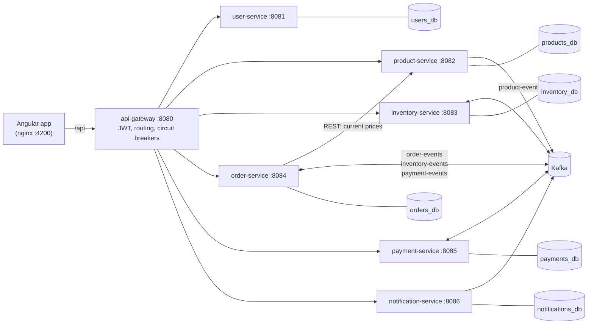

# ShopStream

An event-driven e-commerce platform for learning full stack Java development. It has seven Spring Boot microservices, Kafka, PostgreSQL, an Angular frontend, Docker, CI/CD pipelines, and Kubernetes and Terraform setups for AWS and Azure.

Customers browse a catalog, fill a cart and place orders. Every order runs a **saga** across several services connected by Kafka. On the order page you can watch it move from `PENDING` to `INVENTORY_RESERVED` to `CONFIRMED`, or get rolled back to `CANCELLED`.



## Where each skill from the job description lives

| Skill | Where to look |
|---|---|
| Java 8+ / Core Java | Records, streams, `Optional`, `BigDecimal`, enums with behavior, collectors. [Learning guide, section 2](docs/LEARNING-GUIDE.md#2-core-java) maps each Java 9-17 feature back to Java 8. |
| Spring Boot / Spring Framework | Every `*-service` module: dependency injection, `@ConfigurationProperties`, `@Transactional`, Spring Data JPA, auto-configuration (`shopstream-common`) |
| Angular | `frontend/`: Angular 20, standalone components, signals, routing with guards, HTTP interceptor, reactive forms, RxJS |
| REST API design and integration | Controllers in each service, RFC 7807 errors, validation, `RestClient` call from order-service to product-service, [api-requests.http](api-requests.http) |
| Microservices | 7 services, API gateway, database per service, circuit breakers, health probes |
| SQL / relational databases | PostgreSQL, Flyway migrations, indexes, constraints, JPA relationships, row locking (`SELECT ... FOR UPDATE`) |
| Event-driven / messaging | Kafka topics, consumer groups, choreography saga, transactional outbox, idempotent consumers, dead-letter topics |
| Git, CI/CD, DevOps | [GitHub Actions](.github/workflows), [Jenkinsfile](Jenkinsfile), Dockerfiles, Docker Compose, [branching guide](CONTRIBUTING.md) |
| Cloud (AWS / Azure) | [Terraform for EKS + RDS + MSK](infra/terraform/aws), [Azure CLI script for AKS + PostgreSQL + Event Hubs](infra/azure), [Kubernetes manifests](infra/k8s) |
| Agile / Scrum | [Backlog with user stories](docs/agile/BACKLOG.md), [sprint plan](docs/agile/SPRINT-PLAN.md), [definition of done](docs/agile/WORKING-AGREEMENT.md), issue and PR templates |

## Run it on your laptop

**You need:** Git and [Docker Desktop](https://www.docker.com/products/docker-desktop/) with at least **6 GB of memory** allocated (Docker Desktop → Settings → Resources). Nothing else: Java, Maven and Node run inside the build containers.

```bash
git clone <your-repo-url> shopstream
cd shopstream
docker compose up --build
```

The first build downloads Maven and npm dependencies and takes 5 to 10 minutes. Later builds are much faster. When `docker compose ps` shows the services as `healthy`, open:

| What | URL | Login |
|---|---|---|
| **The shop** | http://localhost:4200 | Sign up, or use `admin@shopstream.dev` / `Admin@12345` |
| API gateway | http://localhost:8080/api/products | |
| Kafka UI (topics, messages, consumer lag) | http://localhost:8090 | |
| Adminer (browse the databases) | http://localhost:8091 | System `PostgreSQL`, server `postgres`, user/password `shopstream`, database e.g. `orders_db` |
| Swagger UI per service | http://localhost:8081/swagger-ui.html (ports 8081-8086) | |

### Try the three saga paths

1. **Happy path:** add anything to the cart and place the order. It becomes `CONFIRMED` within about 2 seconds.
2. **Payment declined:** buy the *Pro Creator Laptop 16* ($5,499). The demo payment provider declines anything above $5,000, so the order is `CANCELLED` and inventory **releases** the stock it had reserved. That release is the saga's compensating action.
3. **Out of stock:** order 3 *Limited Edition Mechanical Keyboards* (only 2 in stock). Inventory rejects it and nothing is charged.

Then open Kafka UI and look at the `order-events`, `inventory-events` and `payment-events` topics to see the actual messages.

### Automated end-to-end check

```bash
./scripts/smoke-test.sh
```

It registers a user, runs all three saga paths through the gateway and checks the results.

## Developer mode: run services from your IDE

This mode needs **JDK 25 or newer** and **Node 22** on your machine (Maven comes with the repo as `./mvnw`). Start only the infrastructure in Docker:

```bash
docker compose up -d postgres kafka kafka-ui adminer
```

Then run any service from IntelliJ (its `*Application` class) or from the terminal. The defaults in each `application.yml` point at `localhost:5432` and `localhost:29092`:

```bash
./mvnw install -DskipTests                # once: puts shopstream-common in your local Maven repo
./mvnw -pl order-service spring-boot:run  # Windows: mvnw.cmd instead of ./mvnw
```

Frontend with live reload (proxies `/api` to the gateway on :8080):

```bash
cd frontend
npm install
npm start          # http://localhost:4200
```

You can mix both modes. For example, run everything in Docker, then `docker compose stop order-service` and run order-service in your debugger instead.

## Tests

```bash
./mvnw verify                 # all backend unit tests (JUnit 5, Mockito, MockMvc)
cd frontend && npm test       # Angular tests in Chrome (Jasmine + Karma)
```

## Project layout

```
shopstream/
├── pom.xml                   Maven parent: versions for every service
├── shopstream-common/        shared Kafka event records + Kafka auto-configuration
├── api-gateway/              Spring Cloud Gateway: routing, JWT check, CORS, circuit breakers
├── user-service/             register / login, BCrypt, issues JWTs
├── product-service/          catalog, search, admin CRUD, publishes ProductCreatedEvent
├── inventory-service/        stock, reservations, releases stock on cancellation
├── order-service/            places orders, runs the saga, transactional outbox
├── payment-service/          charges orders (fake provider), idempotent
├── notification-service/     turns order events into notifications + "emails"
├── frontend/                 Angular 20 app + nginx config + Dockerfile
├── backend.Dockerfile        one multi-stage Dockerfile for all Java services
├── docker-compose.yml        the full local stack
├── infra/
│   ├── postgres/             creates the six databases
│   ├── k8s/                  Kustomize base + AWS and Azure overlays
│   ├── terraform/aws/        VPC, EKS, RDS PostgreSQL, MSK Kafka
│   └── azure/provision.sh    AKS, ACR, PostgreSQL, Event Hubs
├── .github/workflows/        CI (build, test, images) and CD (deploy to EKS)
├── Jenkinsfile               the same pipeline for Jenkins
├── scripts/smoke-test.sh     end-to-end check
├── api-requests.http         every API call, ready to run in IntelliJ
└── docs/                     architecture, learning guide, cloud guide, agile docs
```

## Documentation

- [docs/ARCHITECTURE.md](docs/ARCHITECTURE.md): how the pieces fit together, the saga step by step, and why each pattern is there
- [docs/LEARNING-GUIDE.md](docs/LEARNING-GUIDE.md): a reading order through the code, experiments to run and exercises to build
- [docs/CLOUD-DEPLOYMENT.md](docs/CLOUD-DEPLOYMENT.md): deploying to AWS (EKS) or Azure (AKS)
- [docs/agile/](docs/agile): backlog, sprint plan, working agreement
- [CONTRIBUTING.md](CONTRIBUTING.md): Git branching, commit messages, pull requests

## Troubleshooting

- **A port is already in use.** Stop whatever uses it, or change the left side of the port mapping in `docker-compose.yml` (for example `"5433:5432"`).
- **Containers keep restarting, or the build is killed.** Docker needs more memory. Give Docker Desktop 6-8 GB.
- **"Service Unavailable" right after startup.** A service is still starting, so the gateway's circuit breaker returns 503. Wait for `docker compose ps` to show everything as healthy.
- **Start over with empty databases:** `docker compose down -v && docker compose up --build`.
- **Apple Silicon (M1-M4):** all images used here are multi-architecture, so no extra steps are needed.
