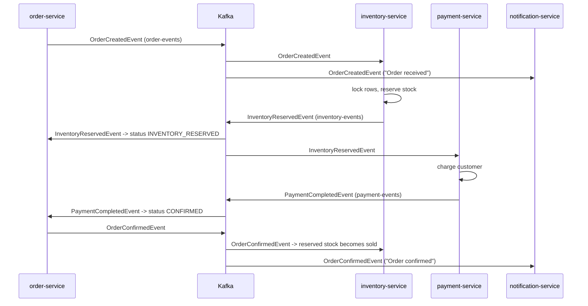
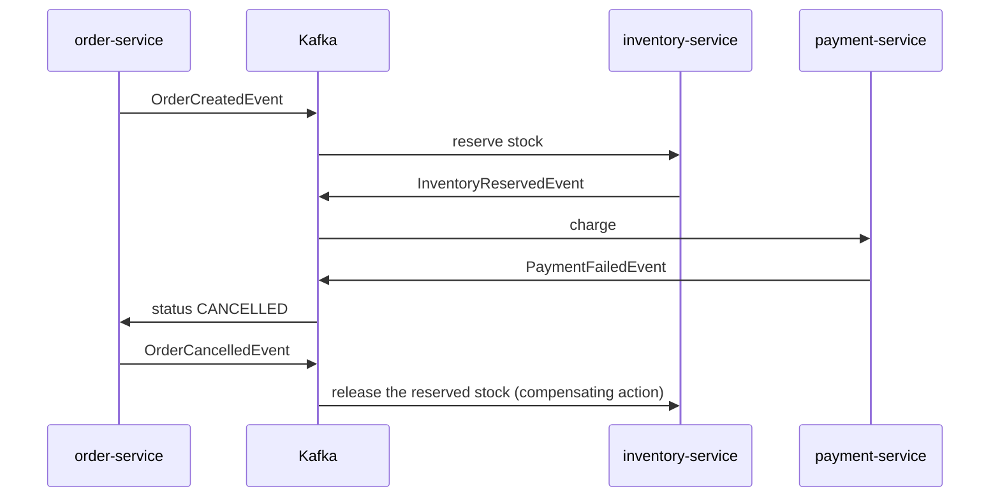

# Architecture

This page explains how ShopStream is put together and why. Every pattern here exists to solve a specific problem, and each section names that problem.

## Services at a glance

| Service | Port | Database | Publishes | Consumes | Job |
|---|---|---|---|---|---|
| api-gateway | 8080 | none | | | Single entry point. Routes `/api/**`, validates JWTs, CORS, circuit breakers |
| user-service | 8081 | users_db | | | Register, login, BCrypt password hashes, issues JWTs |
| product-service | 8082 | products_db | `ProductCreatedEvent` | | Catalog, search, admin CRUD |
| inventory-service | 8083 | inventory_db | `InventoryReserved/RejectedEvent` | order-events, product-events | Stock levels and reservations |
| order-service | 8084 | orders_db | `OrderCreated/Confirmed/CancelledEvent` | inventory-events, payment-events | Places orders, owns the order's state |
| payment-service | 8085 | payments_db | `PaymentCompleted/FailedEvent` | inventory-events | Charges the customer (fake provider) |
| notification-service | 8086 | notifications_db | | order-events | In-app notifications and (logged) emails |

## Request flow: what happens when you click "Place order"

1. **Browser → nginx → gateway.** Angular calls `POST /api/orders` with `Authorization: Bearer <jwt>`. nginx forwards `/api` to the gateway.
2. **Gateway.** `JwtAuthenticationFilter` checks the token's signature and expiry, removes any `X-User-*` headers the caller tried to send, and adds trusted `X-User-Id`, `X-User-Email` and `X-User-Role` headers. It then routes the request to order-service.
3. **order-service (synchronous part).**
   - Calls product-service over REST (`ProductClient`) for current prices. The browser never decides prices.
   - In **one database transaction**: inserts the order (`PENDING`), its items, a status-history row, and an **outbox** row holding `OrderCreatedEvent`.
   - Returns `201 Created` right away. Everything after this happens asynchronously.
4. **Outbox publisher.** Every 500 ms it picks up unpublished outbox rows and sends them to Kafka.
5. **The saga** continues through events (next section).
6. **Browser** polls `GET /api/orders/{id}` every second and redraws the progress steps.

## The order saga

A single order touches three databases (orders, inventory, payments). A normal database transaction cannot span them, so ShopStream uses a **saga**: a sequence of local transactions, each triggered by the previous step's event. When a step fails, earlier steps are undone by **compensating actions**.

This saga uses **choreography**: no central coordinator. Each service reacts to events and publishes its own.

### Happy path

### Payment declined (compensation)

### Out of stock

inventory-service publishes `InventoryRejectedEvent`, order-service cancels the order, and payment-service never sees it. Nothing needs compensating because nothing was reserved.

### Choreography vs orchestration

| | Choreography (used here) | Orchestration |
|---|---|---|
| Who decides the next step | Each service reacts to events | One orchestrator sends commands |
| Coupling | Services only know event types | Orchestrator knows every step |
| Seeing the whole flow | Spread across services (hence the status history table) | In one place |
| Good for | Short flows with few steps | Long flows, many branches, timeouts |

Converting this saga to orchestration is one of the exercises in the learning guide.

## Patterns and the problems they solve

### API gateway (`api-gateway`)
**Problem:** without it, the browser would need to know seven addresses, and every service would handle CORS and authentication itself.
**Solution:** one entry point. The gateway authenticates the caller; each service still decides what the caller may do (the admin checks in product-service and inventory-service). Circuit breakers (Resilience4j) return a fast `503` instead of hanging when a service is down.

### Database per service
**Problem:** if services share tables, one team's schema change breaks another team's service, and nobody can deploy alone.
**Solution:** each service owns its database. Other services only get data through its API or its events. For example, order-service keeps its own copy of the product name and price as it was at order time. Locally, all six databases share one PostgreSQL server to save memory.

### Transactional outbox (`order-service/.../outbox`)
**Problem (dual write):** saving the order and publishing the event are two separate systems. If one succeeds and the other fails, you get either a stuck order or an event about an order that does not exist.
**Solution:** write the event to an `outbox_events` table **in the same transaction** as the order. A poller sends pending rows to Kafka and marks them as published. `FOR UPDATE SKIP LOCKED` lets several order-service instances poll without sending the same row twice. Production systems often use Debezium (change data capture) instead of polling.

Compare with product-service, which publishes after the commit (`@TransactionalEventListener(AFTER_COMMIT)`). That is simpler, but an event can be lost if the process crashes right after the commit. It is acceptable for "new product" events and not for orders.

### At-least-once delivery and idempotent consumers
**Problem:** Kafka can deliver the same message more than once, for example after a consumer crashes before committing its offset.
**Solution:** every consumer is idempotent, meaning processing a message twice has the same effect as processing it once:
- inventory-service: one `stock_reservations` row per order (`UNIQUE(order_id)`). A duplicate event finds the row and stops.
- payment-service: one `payments` row per order (`UNIQUE(order_id)`). An order is never charged twice.
- notification-service: stores the event's `eventId` (`UNIQUE(source_event_id)`).
- order-service: state transitions ignore events that do not apply, for example a late `InventoryReservedEvent` for an order that is already `CONFIRMED`.

### Message ordering: keys and partitions
Each topic has 3 partitions. Every event about an order uses the **order id as the message key**, so all events for one order land in the same partition and are read in order. Events for different orders are processed in parallel.

### Dead-letter topics (`shopstream-common/.../KafkaErrorHandlingAutoConfiguration`)
**Problem:** a message that always fails (a bug, bad data) would block its partition forever, or be silently dropped.
**Solution:** retry 3 times, 1 second apart, then publish it to `<topic>.DLT` (for example `order-events.DLT`). You can inspect it in Kafka UI and replay it once the bug is fixed.

### Locking
- **Pessimistic** (inventory): `SELECT ... FOR UPDATE` on stock rows while reserving, so two orders cannot both take the last unit. Rows are always locked in product-id order to avoid deadlocks.
- **Optimistic** (orders): the `@Version` column. If two events update the same order at the same moment, one fails with `OptimisticLockException` and the Kafka error handler retries it.

### Authentication with JWT
user-service signs a token (HMAC-SHA256) containing user id, email and role. The gateway verifies the signature with the same secret. Tokens are stateless: no session store is needed, and any gateway instance can verify any token. The trade-off is that a token cannot be revoked before it expires, so keep expiry times short. Production setups often use an identity provider (Keycloak, Cognito, Entra ID) with asymmetric keys (RS256 and a JWKS endpoint), so services only need the public key.

### Synchronous vs asynchronous communication
- **REST (sync):** when the caller needs the answer to continue, like order-service needing prices. Always set timeouts.
- **Events (async):** when the caller does not need to wait, or several services should react. The producer does not know who listens: notification-service was added without changing order-service.

## Kafka vs JMS / IBM MQ

The job description mentions "Kafka, JMS, MQ". They solve overlapping problems in different ways:

| | Kafka | JMS brokers (ActiveMQ, IBM MQ, RabbitMQ) |
|---|---|---|
| Model | Append-only **log**. Messages stay for a retention period | **Queue**. A message is removed once consumed |
| Many consumers | Each consumer group reads every message independently | Queues: one consumer gets each message. Topics: pub/sub |
| Replay | Yes: reset the offset and re-read history | No, once consumed it is gone |
| Ordering | Per partition | Per queue (weaker when consumers compete) |
| Typical use | Event streaming, event sourcing, high throughput, integration hub | Task queues, request/reply, legacy enterprise integration, transactions (XA) |

In Spring the programming model is almost the same: `@KafkaListener` vs `@JmsListener`, `KafkaTemplate` vs `JmsTemplate`. The learning guide has an exercise that adds a JMS queue next to Kafka.

## What a production system would add

This is a learning project, so some things are simplified on purpose:

- **Observability:** distributed tracing (Micrometer Tracing + OpenTelemetry, with Zipkin or Jaeger), central logs (ELK or Loki), metrics dashboards (Prometheus + Grafana, using the Actuator metrics that are already exposed).
- **Security:** HTTPS everywhere, an identity provider, secrets in AWS Secrets Manager or Azure Key Vault, network policies between pods, and no direct access to service ports (they are exposed here only so you can use Swagger UI).
- **Schema management:** Avro or Protobuf with a schema registry instead of a shared jar of Java records.
- **Resilience:** retries with backoff on the REST call, rate limiting at the gateway (Redis), bulkheads.
- **Data:** read replicas, backups, and a separate database server per service when the load justifies it.
- **Testing:** integration tests with Testcontainers (real PostgreSQL and Kafka in Docker), contract tests between services (Spring Cloud Contract or Pact), end-to-end UI tests (Playwright).
